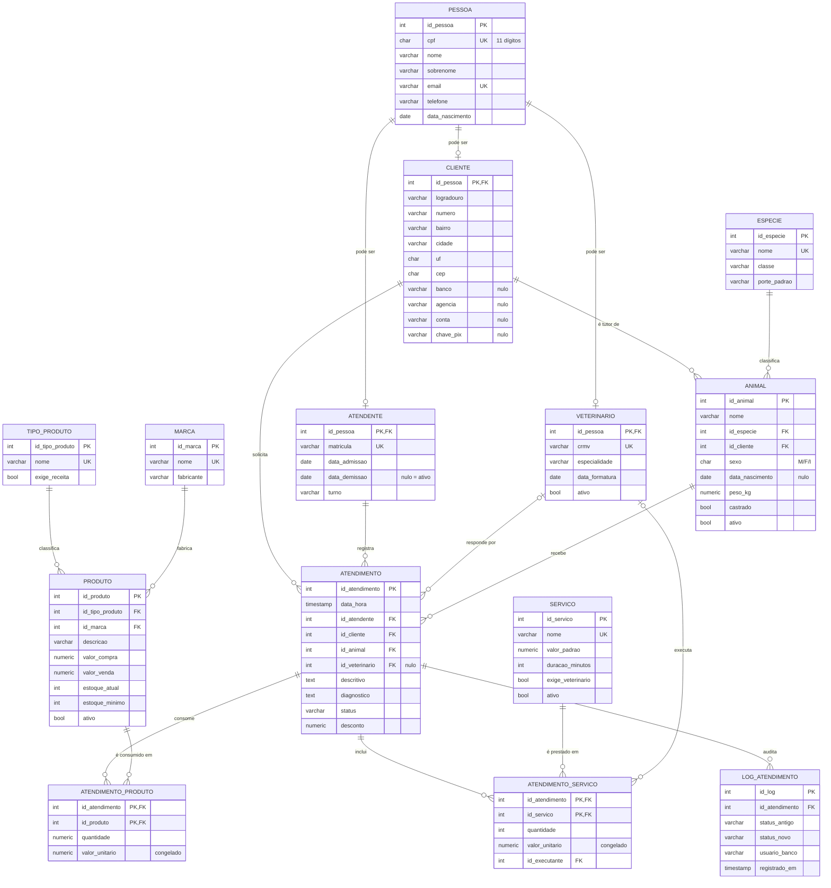

# Sistema de Gestão de Clínica Veterinária

## Sobre o projeto

Tema: Clínica veterinária

Objetivo: Sistema de banco de dados para uma clínica veterinária, cobrindo o atendimento clínico dos animais e a venda de produtos e serviços. Controla estoque, guarda o histórico de preço cobrado em cada atendimento e não deixa cadastrar dado inconsistente.

Público-alvo: Atendentes (cadastro de tutor e animal, agenda), veterinários (prontuário e diagnóstico) e a gestão da clínica (faturamento, estoque).

Observação: o mesmo atendente também pode ser cliente da clínica (levar o próprio animal pra atender), por isso pessoa não é uma tabela só de cliente — ela pode virar cliente, atendente e/ou veterinário através de tabelas ligadas por id_pessoa.

## Modelo de dados

## Scripts

Os scripts estão na pasta scripts/, na ordem que devem ser executados:

1. create_table_pessoa.sql
2. create_table_cliente.sql
3. create_table_atendente.sql
4. create_table_veterinario.sql
5. create_table_especie.sql
6. create_table_animal.sql
7. create_table_tipo_produto.sql
8. create_table_marca.sql
9. create_table_produto.sql
10. create_table_servico.sql
11. create_table_atendimento.sql
12. create_table_atendimento_produto.sql
13. create_table_atendimento_servico.sql
14. create_index_consultas_frequentes.sql
15. add_telefone_emergencia_to_cliente.sql
16. create_or_replace_function_calcula_total_atendimento.sql
17. create_or_replace_function_idade_animal.sql
18. create_trigger_valida_tutor_do_animal.sql
19. create_trigger_baixa_estoque_produto.sql
20. create_trigger_log_auditoria_atendimento.sql
21. create_view_pessoas_atendentes.sql
22. create_view_atendimentos_detalhados.sql
23. create_view_faturamento_por_mes.sql
24. create_view_prontuario_animal.sql
25. create_or_replace_procedure_registra_atendimento.sql
26. create_or_replace_procedure_repoe_estoque.sql
27. insert_into_tabelas_basicas.sql
28. insert_into_pessoa.sql
29. insert_into_animal.sql
30. insert_into_produto_e_servico.sql
31. insert_into_atendimento.sql
32. update_delete_validacao_comportamento.sql

Autor Pedro Henrique Silva - [@PedroBirudevs] -- LINK DO REPOSITORIO --
[https://github.com/PedroBirudevs/clinica-veterinaria-bd](https://github.com/PedroBirudevs/clinica-veterinaria-bd)

Outros integrantes do Grupo: João Paulo Dias, João Victor, Maykon, Saymon.
